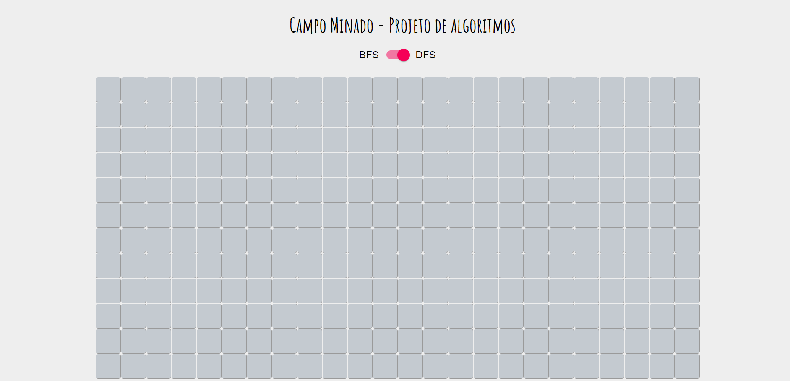
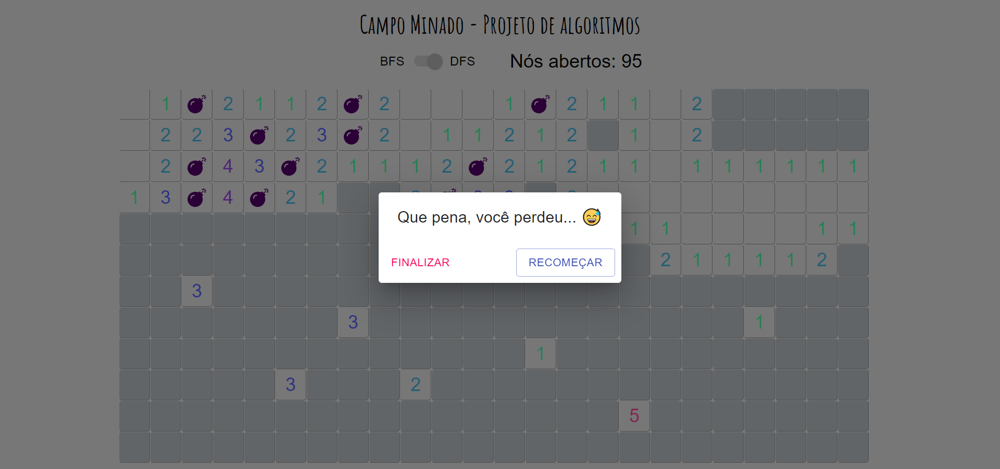

# Campo Minado

**Número da Lista**: 20

**Conteúdo da Disciplina**: Grafos1

## Alunos

| Matrícula  | Aluno                           |
| ---------- | ------------------------------- |
| 18/0054848 | Rhuan Carlos Pereira de Queiroz |
| 18/0028308 | Thiago Guilherme Muniz Ferreira |

## Sobre

Um jogo de campo minado, simples, para poder visualizar o funcionando do algoritmo flood fill implementado tanto com BFS e DFS.

## Screenshots

Um GIF também está disponível para visualização [aqui](https://drive.google.com/file/d/1gICQWdWi2OWrGH9mgetofJ91-QURF5A_/view?usp=sharing).

## Instalação

**Linguagem**: Javascript

**Framework**: React.js

Instale as dependências do projeto usando o npm ou yarn:
`npm install` ou `yarn`

Inicie o servidor local:
`npm start` ou `yarn start`

## Uso

Abra navegador em `localhost:3000`, clique em um bloco, divirta-se (a menos que seu primeiro clique seja uma bomba)!

## Outros

Se estiver achando muito difícil, entre no arquivo `utils/constants.js` e diminua a constante `BOMB_RATIO`.

**IMPORTANTE:** Atualize a página, mesmo que o hot reload já tenha atualizado, evita promises perdidas...

## Vídeo

O video de apresentação se encontra na pasta video.
